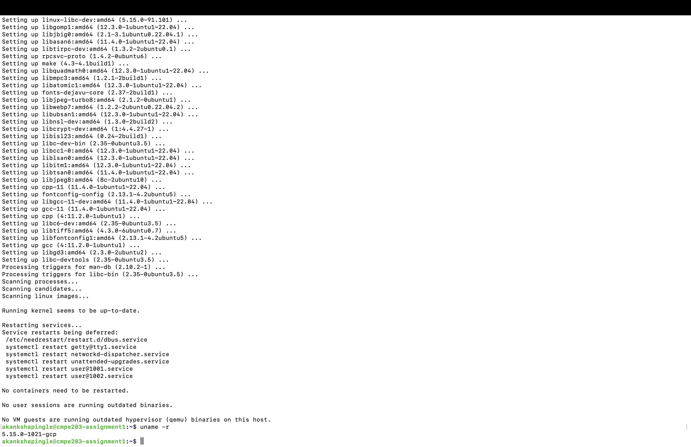

# CMPE283 : Virtualization 
# Assignment 1: Discovering VMX Features

#### 1. For each member in your team, provide 1 paragraph detailing what parts of the lab that member  implemented / researched. (You may skip this question if you are doing the lab by yourself).
- *Akanksha Pingle(22544463453)*
  - Created VM on google cloud compute engine using cloudshell.
  - Installed required dependencies on launched VM : gcc, make, linux-headers.
  - Enabled SSH Authentication on VM launched on google cloud.
  - Upgraded the ubuntu OS to latest using `apt-get update` and `apt-get upgrade`
  - Defined code to Read MSR to know capabilities for VMENTRY, VMEXIT and Primary Procbased controls.
  - Defined code to Read MSR to know capabilities for Secondary and Teritary Procbased controls.
  - complied new module using `make` to load new module in to the kernel and inserted module in kernel.
  - updated readme file with instruction to launch VM instance and compiling the new module, committed [dmesg](cmpe283-1/dmesg.out) to git.

- *Saharat Saengsawang*
  - Gathered definitions for VMX capabilities for VMEXIT and Teritary Procbased controls.
  - Gathered definitions for VMX capabilities for VMENTRY, Primary and Secondary Procbased controls.
  - updated readme file with instruction to ssh to VM instance, inserting new module and removing new module to kernel.
  - committed compiled modules to the git to establish evidence of completion of required module.

#### 2. Describe in detail the steps you used to complete the assignment. Consider your reader to be someone  skilled in software development but otherwise unfamiliar with the assignment. Good answers to this  question will be recipes that someone can follow to reproduce your development steps. Note: I may decide to follow these instructions for random assignments, so you should make sure  they are accurate.

1. Created a VM on gcloud using the insturctions that are required for creating a virtualization machine with virtualization capabilities enabled.
    - use cloud shell commmand to get the details about the account from google compute engine
    - add additional details to the cloud shell command to launch instance using instructions provided.
    - generate ssh key on your local machine if it not exits
      ```
      ssh-keygen -t ed25519
      ```
    - Final cloud shell command with all the vm capabilitis with your ssh keys in metadata.
        ```
        gcloud compute instances create cmpe283-assignment1 --project=profound-hydra-408303 --zone=us-central1-a --machine-type=n2-standard-8 --network-interface=network-tier=PREMIUM,subnet=default --metadata=ssh-keys=akankshapingle:ssh-ed25519\ AAAAC3NzaC1lZDI1NTE5AAAAIM+X4GIxPUVhMvHAVE59GLqJSYPEGZjKgM3jqLJSP9aG\ akankshavallabh.pingle@sjsu.edu --maintenance-policy=MIGRATE --provisioning-model=STANDARD --service-account=22544463453-compute@developer.gserviceaccount.com --scopes=https://www.googleapis.com/auth/devstorage.read_only,https://www.googleapis.com/auth/logging.write,https://www.googleapis.com/auth/monitoring.write,https://www.googleapis.com/auth/servicecontrol,https://www.googleapis.com/auth/service.management.readonly,https://www.googleapis.com/auth/trace.append --create-disk=auto-delete=yes,boot=yes,device-name=cmpe283-assignment1,image=projects/ubuntu-os-cloud/global/images/ubuntu-2204-jammy-v20221018,mode=rw,size=100,type=projects/profound-hydra-408303/zones/us-central1-a/diskTypes/pd-balanced --no-shielded-secure-boot --shielded-vtpm --shielded-integrity-monitoring --reservation-affinity=any --min-cpu-platform "Intel Cascade Lake" --enable-nested-virtualization
        ```
        
2. Launched Instance with the SSH Keys Metadata added.


3. We can Login to the launched instance using two methods
    - ssh connect from the google compute engine [instances](https://console.cloud.google.com/compute/instances?project=profound-hydra-408303) page. Connected instance through SSH, launched on a web browser.
    
    - ssh connect to the instance where the private key exist for the public key that has been added for your users.
    
4. Installed required dependencies to perform the assignment that loads a new module into kernel.
```
sudo apt-get update
sudo apt-get upgrade
sudo apt-get install vim gcc make linux-headers-$(uname -r)
```

5. From Intel SDM Module. Get the Description for the MSR with Address from the Following Pages as per assignment requirements.
  -  IA32_VMX_PINBASED_CTLS 0x481 : Intel SDM volume 3, section 24.6.1 Table 24.5 Page 3746
  -  IA32_VMX_PROCBASED_CTLS 0x482 : Intel SDM volume 3, section 24.6.2 Table 24.6 Page 3746,3747
  -  IA32_VMX_PROCBASED_CTLS2 0x48B : Intel SDM volume 3, section 24.6.2 Table 24.7 Page 3748
  -  IA32_VMX_EXIT_CTLS 0x483 : Intel SDM volume 3, section 24.6.2 Table 24.13 Page 3756
  -  IA32_VMX_ENTRY_CTLS 0x484 : Intel SDM volume 3, section 24.6.2 Table 24.15 Page 3758
  -  IA32_VMX_PROCBASED_CTLS3 0x492 : Intel SDM volume 3, section 24.6.2 Table 24.8 Page 3749
6. Once the Sturct Definition is Done, scp the required code files in to the noed.
   - created a new folder for [cmpe283-1](cmpe283-1) module that gets loaded in to the kernel and scped the files to node.
   - scp file [cmpe283-1.c](cmpe283-1/cmpe283-1.c) to the created virtual machine.
   - scp file [MakeFile](cmpe283-1/Makefile) to the created virtual machine.
7. execute make to generate the required module files.
```
akankshapingle@cmpe283-assignment1:~/cmpe283-1$ ls
Makefile  cmpe283-1.c
akankshapingle@cmpe283-assignment1:~/cmpe283-1$ make
make -C /lib/modules/5.15.0-1021-gcp/build M=/home/akankshapingle/cmpe283-1 modules
CC [M] /home/akankshapingle/cmpe283-1/cmpe283-1.0
MODPOST/home/akankshapingle/cmpe283-1/Module.symvers
CC [M] /home/akankshapingle/cmpe283-1/cmpe283-1.mod.o
LD [M] /home/akankshapingle/cmpe283-1/cmpe283-1.ko
make[1]: Leaving directory '/usr/src/linux-headers-5.15.0-1021-gcp'

```
8. Check if the files are generated using ls command.

9. Insert the generated module using the following command and check output using dmesg.
```
sudo insmod ./cmpe283-1.ko
sudo dmesg
```


10. Remove the generated module using the following command
```
sudo rmmod cmpe283-1
```

### References
- [Intel® 64 and IA-32 Architectures Software Developer Manuals](https://cdrdv2.intel.com/v1/dl/getContent/671200)
- [Enabling nested virtualization](https://cloud.google.com/compute/docs/instances/nested-virtualization/enabling#gcloud)